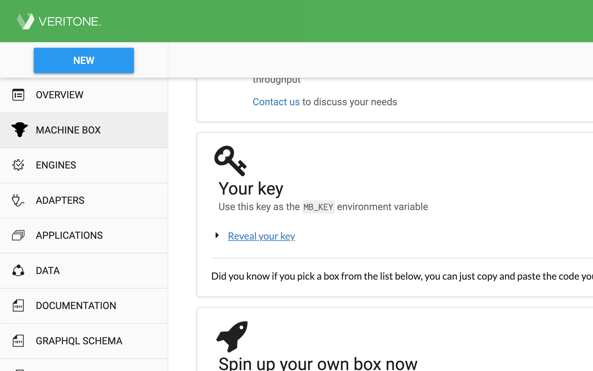
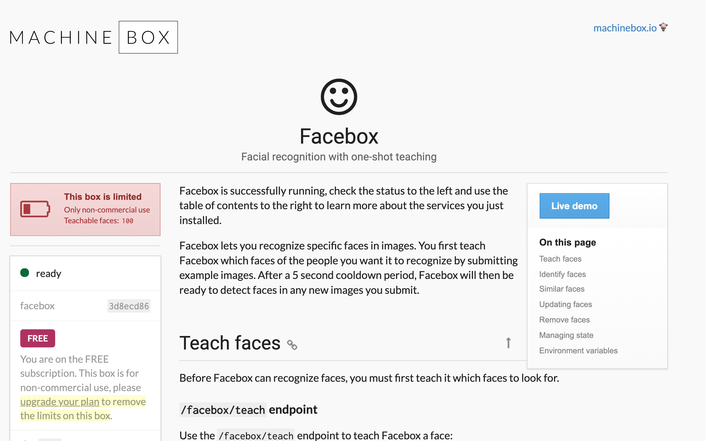

## GoFaceTrainer - Train a facial recognition model in Go

[](https://goreportcard.com/report/github.com/adrianosela/GoFaceTrainer)
[](https://godoc.org/github.com/adrianosela/GoFaceTrainer)
[](https://github.com/adrianosela/GoFaceTrainer/issues)
[](https://github.com/adrianosela/GoFaceTrainer/blob/master/LICENSE)

### Step-By-Step Tutorial: 

* **STEP 0 - Prerequisites:**
 * Download OpenCV for your OS
 * Download Docker for your OS
 * Download the Go Programming Language (Golang)
 * Clone this repository:
```git clone https://github.com/adrianosela/GoFaceTrainer```

* **STEP 1 - Getting a Machine Box API key:** 
 * Head over to ```https://machinebox.io/account``` and create a Veritone account; follow the account creation procedure (confirmation email, web app onboarding, etc)
 * On the web application, click on "Machine Box" on the left side dropdown
 * Scroll down to "Your key" and click on "Reveal your key"
 * Copy and save this API key somewhere safe; you will use it to authenticate against a local Machine Box API which we will deploy later on in this tutorial. I exported it on my command line: ```export MB_KEY=[the key]```



* **STEP 2 - Running Machine Box Locally:**
 * Pull the [machinebox/facebox](https://hub.docker.com/r/machinebox/facebox) Docker image: ```docker pull machinebox/facebox```
 * Run the Docker image, mapping port 8080 on the container to your desired port on your machine (I have chosen port 8080 for my machine port as well), passing your Machine Box API key from step 1 as the ```MB_KEY``` environment variable (example command below). Note that you can override the container's serving port (default 8080) with the ```MB_PORT``` environment variable
 * On your browser, head over to http://localhost:[mapped-port] and verify you can see the Machine Box console/UI

```
$ docker run -p 8080:8080 -e "MB_KEY=$MB_KEY" machinebox/facebox
[INFO]     starting...

	Welcome to Facebox by Machine Box
	(facebox 3d8ecd86)

	Visit the console to see what this box can do:
	http://localhost:8080

	If you have any questions or feedback, get in touch:
	https://machinebox.io/contact

	Report bugs and issues:
	https://github.com/machinebox/issues

	Tell us what you build on Twitter @machineboxio

[INFO]     box ready
```



* **STEP 3 - Sample Your Face:**
 * Change directory to the ```/photoshoot``` subdirectory of this repository and and run the Go program there with the name of the person whose face is being sampled as the first argument and the number of samples to be taken for that person as the second argument: ```go run main.go [NAME-OF-PERSON-IN-FRONT-OF-CAMERA] [N-SAMPLES]```
 * The program will sample your face and publish them to your local Machine Box server to train the model. Note that while more samples means more accurate predictions can be made, if your Machine Box account is free/non-commercial, you are limited to 100 faces (samples). However, you can always remove faces in the Facebox UI if you hit this limit
 * Repeat this step for as many people as you want your model to recognize
 * If you would like the model to recognize multiple facial-expressions for the same person instead of different people, you can use names for the facial-expression as the first argument instead (e.g. "Winking", "Tonge out", "Sad Face", etc...)
 
 > // TODO: Insert cmd line output example here

* **STEP 5 - Test Your Model:**
 * Change directory to the ```/test-model``` subdirectory of this repository and and run the Go program there with no arguments: ```go run main.go```
 * You are done! hopefully your model is accurate enough. If not, you can always try adding more images by repeating Step 4 with the same names you had used before

 > // TODO: Insert cmd line output example here
 
 > // TODO: Insert screen shot of program recognizing self

##### I hope you have enjoyed, issues and PRs are welcome!

### Credit given where credit is due:

This project was inspired by [packagemain's video](https://www.youtube.com/watch?v=rbZeZNVA-Q4): "Face Detection in Go using OpenCV and MachineBox". I highly recommend watching his videos and subscribing if you are a Go enthusiast!
